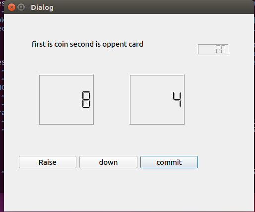
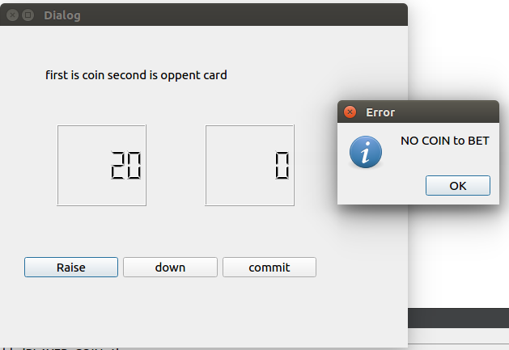
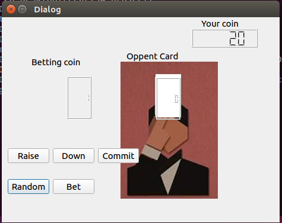
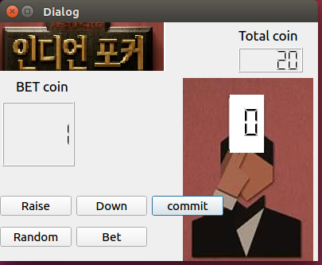

# sw_project
sw project_ to college class

************************************************************
Indian Porker history

jeunghunLee study QT GUI
JuchanKim   study server 

11/26
Now we finish project study. 
We make simple up down buttoon and display.

*************************************************************

<<<<<<< HEAD
push raise is up betting coin
push down is down betting coin
push commit make oppent card
ps) IT IS NOT COMPLETE 

************************************************************
push raise is up betting coin.

push down is down betting coin.

push commit make oppent card.

ps) IT IS NOT COMPLETE .

***********************************************************
1128

make brach to Leejeunghun

I made it to make a mistake when I recover.
and update error 

and I add Total coin LCD

*************

1201 add Image 

**
update UI and 1204 betting system

네트워크 연결하기
1. 방화벽 끄기
2. 머신 -> 설정 -> 네트워크 -> 어댑터에 브리지★(내부랑 동등한 ip포트를 가지게 하는것) 192.168.x.x
네트워크 설정 맞춰주기 : ip, 서브넷, 게이트웨이 
ip가 안 맞으면 IPv4에 들어가서 직접 ip 수정
ping -c 3 상대방ip 연결 확인

Server
1. 서버 설치 (sudo apt-get install nfs-common nfs-kernel-server rpcbind)
2. 공유 디렉토리 생성(mkdir 공유할 폴더) 
2. exports파일 수정(sudo vi /etc/exports)
 2-1 /공유할 폴더 상대ip(rw,sync,no_root_squash)
3. sudo service nfs-kernel-server restart
4. service rpcbind restart
5. chmod -R 777 공유할 폴더

Client 
1. mount할 폴더 생성(mkdir 폴더)
2. sudo mount 서버IP:/공유한 폴더 /마운트할 폴더
