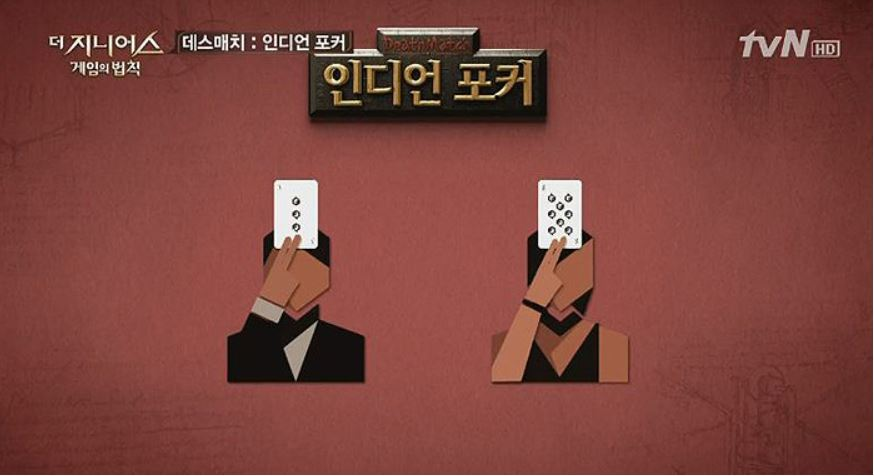
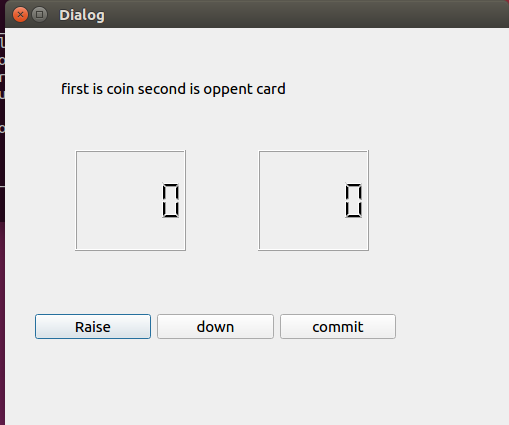
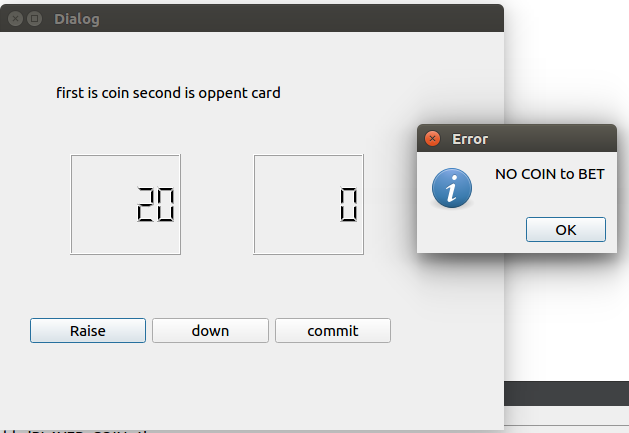

# sw_project
sw project_ to college class

************************************************************
Indian Porker history

jeunghunLee study QT GUI
JuchanKim   study server 

11/26
Now we finish project study. 
We make simple up down buttoon and display.

*************************************************************

<<<<<<< HEAD
push raise is up betting coin
push down is down betting coin
push commit make oppent card
ps) IT IS NOT COMPLETE 

=======
push raise is up betting coin.

push down is down betting coin.

push commit make oppent card.

ps) IT IS NOT COMPLETE .
>>>>>>> e2cc3c383bb74ec68b17f0622de1cc3f06a15899

***********************************************************
1128

make brach to Leejeunghun

I made it to make a mistake when I recover.
and update error 

and I add Total coin LCD

